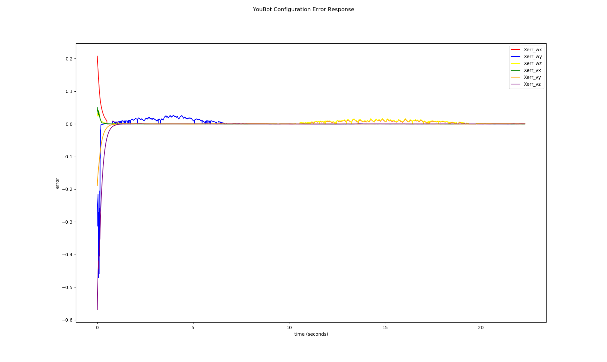

# Final Project Robotics Manipulation

By: *Ryan King-Shepard*

## Contents

The following contents of the assignment are:

1. code/ 
    - Directory of the code files
        - `mile1.py`: Contains the NextState function used to integrate velocities to produce next chassis, wheel, and joint configurations (milestone1 code)
        - `mile2.py`: Contains the TrajectoryGenerator function used to craft the trajectory for milestone2
        - `mile3.py`: Contatins the GetPinvJacobian and FeedBackControl function used to calculate the velocities
        - `run.py`: Main executable
        - `util.py`: Contains plotting function for Xerr plots


2. results/
    - Directory with results of 'best', 'overshoot', and 'new_task'. Each sub_directory has the generated Coppella sim .csv `output.csv`, the corresponding Xerr log `output_xerr.csv`, a plot of the error response `YouBotErrorResp.png`, a Coppella video `[directory name]_bev.mp4` of the robot performing it's tasks, a `README.txt` with controller types and gains, as well as an script logfile `[directory name]_log.txt` to show the output the program should have. 
    
    
3. README.pdf
    - TIS I, NOW WITH SHINY DLC FROM MILESTONE 1 and 3!

## Code Dependencies

The code for this project depends on the modern_robotics package, numpy, argparse and csv. The Python Standard Libraries should already contain argparse and csv; if they are not present, use `pip install [package]` to add them to your python libs. You will need to install modern_robotics(instructions [here](https://github.com/NxRLab/ModernRobotics/tree/master/packages/Python)) and numpy(instructions [here](https://numpy.org/install/))

## Code Execution

The main execution script for this milestone is `run.py`. Below is a copy of the valid arguments

```
usage: run.py [-h] [--output OUTPUT] [--kp KP] [--ki KI]
              [--init_q_config CHASSIS_PHI CHASSIS_X CHASSIS_Y]
              [--init_joint_angles JOINT_POS1 JOINT_POS2 JOINT_POS3 JOINT_POS4 JOINT_POS5]
              [--new_task] [--test_mile1] [--test_mile2] [--test_mile3]

Calculate and output csv for final project animations

optional arguments:
  -h, --help            show this help message and exit
  --output OUTPUT       output csv for animations. Currently only supports
                        milestone 2. Defaults to "output.csv"
  --kp KP               Proportional gain for the feedback controller.
                        Defaults to 0
  --ki KI               Integral gain for the feedback controller. Defaults to
                        0
  --init_q_config CHASSIS_PHI CHASSIS_X CHASSIS_Y
                        Initial chassis configuration; default is s-frame
                        origin
  --init_joint_angles JOINT_POS1 JOINT_POS2 JOINT_POS3 JOINT_POS4 JOINT_POS5
                        Initial joint positions(rad); default is (-np.pi/10,
                        -np.pi/20, -np.pi/20, -np.pi/2, 0.0)
  --new_task            To show robot grabbing block behind it
  --test_mile1          produce only the outputs for milestone 1
  --test_mile2          produce only the outputs for milestone 2
  --test_mile3          produce only the outputs for milestone 3

```

For a simple example to reproduce the outcome in the `results\best` directory: 

`python3 run.py --init_q_config 0.5236 0.1 0.1 --kp 5.5`

Note: if run.py is already seen as an executable, you can also use:

`./run.py --init_q_config 0.5236 0.1 0.1 --kp 5.5`

By default, run should be seen as an executable, but just in-case the grader has a different OS, the python3 option should always work. Note: the logfiles in each directory will use the `./`.

## Solution Summary

For the final project, we combined the work of milestone 2 with the new implemenations of milestone 1 and milestone 3 to have the YouBot complete a mobile manipulation objective. The main process of the software is as such:

1. Generate an end-effector trajectory of the objective being complete. 
2. Loop through the trajectory, for each iteration
    i. Determine the current configuration using odometry of current configurations
    ii. Use the psuedo-inverse Jacobian and Feedback Control to determine velocities
    iii. Apply Euler's integration to produce new chassis, wheel, and joint configuration
3. Compile data into logs and plot Xerr to judge controller performance

Below are three Xerr plots from 'overshoot', 'best', and 'new_task' For the 'overshoot' and 'best' section, the robot performs the original task of moving the cube from (1, 0) to (0, -1) with a 90 degree clockwise change in its orientation. For 'new_task', the robot moves the cube from (.5, .5) to (.5, -.5) with the same 90 degree clockwise change. I chose this new_task because I wanted to see how screw trajectory planning would work for a path that's basically cartesian.


**Overshoot**


For the overshoot, we were trying to design a system too have an underdamped response, resulting it a oscillation before stabilizing. For this, we used a PI controller with feedforward equipped with **gains KP = 2 and KI = 4**. I chose a high KI because I wanted the roots to be complex conjugates in order to cause osciallations. I had to be careful not to pick a high KI, or the errors from integration would be too high. 


**Best**


For the best, I decided to only use a **KP gain of 5.5** to drive the system to converge. There are some minor error from tracking the target, but the controller is able to complete the task. Rather than try to tune an integral gain for no overshoot, I think I would have prefered to alter the rate at which the controller processed (currently at dt=0.01) or add a derivative component instead to deal with the lagging response. 

**New_task**


For the new_task, I decided to use a **KP gain of 4**. Based on tuning for 'best' and 'overshoot', It seemed like a simple P-controller with feedforward could accomplish the goal. There are some tracking errors, but they are fairly small. In the future, I'd like to swap out Euler's Intergration with RK4 to limit simulation error and get a better picture of the scale of tracking errors. 